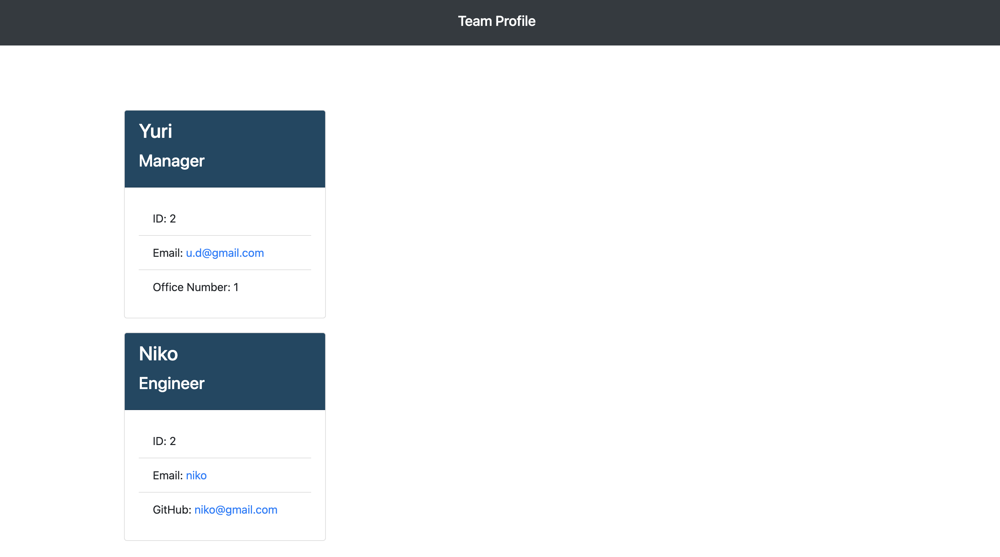

<h1 align="center"> Team Profile Generator 👋</h1> 
 
## Description 

I created a node.js application that uses the users input to create a team profile html webpage that displays a summary about the employee. This application will make it easier to access your teams information like email and github links.

    I learned: 
        * OOP
        * test
        
    I further learned:
        * JavaScript (const, prompts, init)

 

    

## Table of Contents

* [Description](#Description)
* [Installation](#Installation)
* [Usage](#Usage)
* [Contribute](#Contribute)
* [Tests](#Tests)
* [License](#License)
* [Questions](#Questions)
    
## Installation 

Install node.js if you already haven't. 
 
To install necessary dependencies, run the following command:  
`
npm i
`
 

## Usage 
    
From the terminal run:
- node index.js (to run application)
- answer the questions
- your html file will show up in the dist folder
 
✨ Demo: 
 

 
 
Results:
 
Checkout the results in the newRead folder. Below is an example of what the webpage will look like. 
 
 

## Contribute

Please don't hesitate to let me know anything I can update or change. If I like it I'll add it. Thank you.
    
## Tests 

`
npm run test
`

## License

Copyright © Danielle Orley 

licensed under MIT

## Questions 

If you have any questions please see contact information below.  

My GitHub Username: [dorley1993](http://github.com/dorley1993)
    
My Contact Email: daniorley1993@gmail.com
